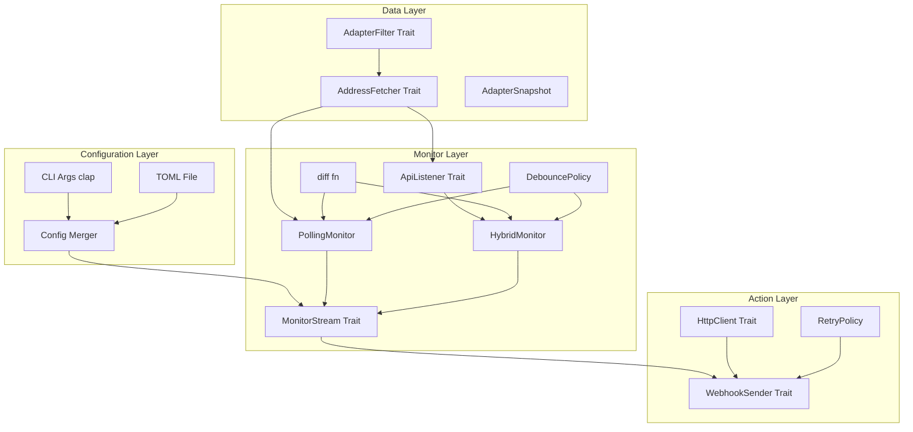

# Implementation Plan

> **Doc Maintenance**: Keep concise, avoid redundancy, clean up outdated content promptly to reduce AI context usage.

## Lint

```
make ci
```

# IPv6 地址变化监听器实现计划

## 架构概览



## 设计原则

### 显式优于隐式（严格执行）

- **IP 版本必须指定**：`--ip-version <ipv4|ipv6|both>` 无默认值，启动时校验
- **无隐式过滤**：默认监听所有网卡，排除规则必须显式配置
- **启动时打印配置摘要**：清晰显示监听的网卡、IP 版本、轮询间隔、过滤规则
- **配置模板完整**：`init` 命令生成包含所有选项的完整 TOML（含注释说明）

### 可测试性优先

- **全依赖注入**：所有外部依赖（网络 API、时钟、HTTP 客户端）通过泛型参数注入
- **Trait 抽象边界**：`AddressFetcher`、`ApiListener`、`WebhookSender`、`Clock` 均为 trait
- **纯函数优先**：状态变化检测为纯函数 `diff(old, new) -> Vec<IpChange>`

### 错误处理策略

- **分层错误类型**：每层定义自己的 Error enum，向上转换，保留 source chain
- **明确恢复策略**：API 失败降级到纯轮询，Webhook 失败按策略重试
- **结构化日志**：所有错误携带上下文，便于排查

### 生命周期与资源管理

- **Graceful Shutdown**：`MonitorStream::run()` 接受 shutdown signal，响应 Ctrl+C / 服务停止信号
- **一次性语义**：`ApiListener::into_stream(self)` 消费 self，API 监听失败后**降级到纯轮询模式**而非重连
  - 设计决策：简化错误恢复逻辑，避免工厂模式的额外复杂度
  - 如未来需要重连恢复，可引入 `ApiListenerFactory` trait

## 模块结构

```text
src/
├── main.rs                    # 入口，依赖组装
├── error.rs                   # 顶层 AppError, ConfigError（组合各层错误）
├── config/
│   ├── mod.rs                 # Config 结构体，合并逻辑
│   ├── cli.rs                 # clap CLI 定义
│   └── file.rs                # TOML 解析
├── network/
│   ├── mod.rs                 # 类型导出
│   ├── types.rs               # NetworkAdapter, AdapterSnapshot, IpVersion
│   ├── filter.rs              # AdapterFilter trait + 组合实现
│   ├── fetcher.rs             # AddressFetcher trait
│   └── platform/
│       ├── mod.rs             # 条件编译导出
│       └── windows.rs         # WindowsFetcher: GetAdaptersAddresses
├── monitor/
│   ├── mod.rs                 # 导出 MonitorStream trait
│   ├── change.rs              # IpChange struct, IpChangeKind enum, diff() 函数
│   ├── error.rs               # MonitorError, ApiError
│   ├── debounce.rs            # DebouncePolicy（事件流的时序处理属于 Monitor 层）
│   ├── poller.rs              # PollingMonitor<F, C>
│   ├── hybrid.rs              # HybridMonitor<F, L, C>
│   └── platform/
│       ├── mod.rs             # 条件编译
│       └── windows.rs         # WindowsApiListener
├── webhook/
│   ├── mod.rs                 # WebhookSender trait
│   ├── error.rs               # RetryableError, WebhookError
│   ├── http.rs                # HttpRequest, HttpResponse, HttpClient trait, HttpError
│   ├── client.rs              # HttpWebhook<H>, ReqwestClient
│   ├── retry.rs               # RetryPolicy, 指数退避
│   └── template.rs            # 模板渲染（可选功能）
└── time.rs                    # Clock trait + SystemClock
```

## CLI 设计

```text
ddns-a [OPTIONS] --url <URL> --ip-version <VERSION>
ddns-a init [--output <FILE>]    # 生成配置模板

必需参数:
    --url <URL>                  Webhook URL
    --ip-version <VERSION>       监听的 IP 版本: ipv4 | ipv6 | both

请求配置:
    --method <METHOD>            HTTP 方法 [default: POST]
    --header <K=V>               自定义 Header (可多次指定)
    --bearer <TOKEN>             Bearer Token (等价于 --header "Authorization=Bearer <TOKEN>")
    --body-template <TEMPLATE>   请求体模板 (Handlebars 语法)

网卡过滤 (默认: 监听所有网卡):
    --include-adapter <PATTERN>  包含的网卡名正则 (可多次，取并集)
    --exclude-adapter <PATTERN>  排除的网卡名正则 (可多次，排除优先)
    --exclude-virtual            排除常见虚拟网卡 (VMware/VirtualBox/Hyper-V/WSL)

监听配置:
    --poll-interval <SEC>        轮询间隔秒数 [default: 60]
    --poll-only                  禁用 API 事件，仅使用轮询

重试配置:
    --retry-max <N>              Webhook 最大重试次数 [default: 3]
    --retry-delay <SEC>          初始重试延迟秒数 [default: 5]

其他:
    --config <FILE>              配置文件路径
    --dry-run                    测试模式：检测变化但不发送 Webhook
    --verbose                    详细日志 (可多次指定增加级别)
```

## 核心类型设计

### 网络层类型

```rust
/// IP 版本（显式指定，无默认值）
#[derive(Debug, Clone, Copy, PartialEq, Eq)]
pub enum IpVersion {
    V4,
    V6,
    Both,
}

/// 网卡类型（平台相关，用于日志/过滤，非核心逻辑）
#[derive(Debug, Clone, PartialEq, Eq)]
pub enum AdapterKind {
    Ethernet,
    Wireless,
    Loopback,
    Virtual,
    Other(u32),  // 保留原始类型码，便于调试
}

/// 单个网卡的地址快照
#[derive(Debug, Clone, PartialEq, Eq)]
pub struct AdapterSnapshot {
    pub name: String,
    pub kind: AdapterKind,
    pub ipv4_addresses: Vec<Ipv4Addr>,
    pub ipv6_addresses: Vec<Ipv6Addr>,
}

/// 获取地址的 trait（可注入 mock）
pub trait AddressFetcher: Send + Sync {
    fn fetch(&self) -> Result<Vec<AdapterSnapshot>, FetchError>;
}
```

### 过滤器设计（数据源层过滤）

```rust
/// 过滤器在数据源层应用，减少不必要的处理
pub trait AdapterFilter: Send + Sync {
    fn matches(&self, adapter: &AdapterSnapshot) -> bool;
}

/// 组合过滤器（AND 语义）
pub struct CompositeFilter {
    filters: Vec<Box<dyn AdapterFilter>>,
}

/// 带过滤的 Fetcher 装饰器
pub struct FilteredFetcher<F, A> {
    inner: F,
    filter: A,
}

impl<F: AddressFetcher, A: AdapterFilter> AddressFetcher for FilteredFetcher<F, A> {
    fn fetch(&self) -> Result<Vec<AdapterSnapshot>, FetchError> {
        self.inner.fetch().map(|adapters| {
            adapters.into_iter().filter(|a| self.filter.matches(a)).collect()
        })
    }
}
```

过滤器数量由运行时配置决定，嵌套泛型会导致复杂的类型体操；过滤逻辑非性能热点，Box<dyn> 是务实权衡

### 变化检测（纯函数，易测试）

```rust
// monitor/change.rs

/// IP 变化类型
#[derive(Debug, Clone, Copy, PartialEq, Eq)]
pub enum IpChangeKind {
    Added,
    Removed,
}

/// IP 变化事件（DRY：共用字段提取为 struct）
#[derive(Debug, Clone, PartialEq, Eq)]
pub struct IpChange {
    pub adapter: String,
    pub address: IpAddr,
    pub timestamp: SystemTime,
    pub kind: IpChangeKind,
}

/// 比较两次快照，生成变化列表（模块级纯函数，无需 struct 包装）
pub fn diff(
    old: &[AdapterSnapshot],
    new: &[AdapterSnapshot],
    timestamp: SystemTime,
) -> Vec<IpChange> {
    // 实现：按 adapter name 分组比较
}
```

### Monitor 设计（完整依赖注入）

```rust
/// 时钟抽象（测试可注入 mock）
pub trait Clock: Send + Sync {
    fn now(&self) -> SystemTime;
}

pub struct SystemClock;
impl Clock for SystemClock {
    fn now(&self) -> SystemTime { SystemTime::now() }
}

/// API 事件监听器错误
#[derive(Debug, thiserror::Error)]
pub enum ApiError {
    #[error("Windows API error: {0}")]
    WindowsApi(#[from] windows::core::Error),
    #[error("Listener stopped unexpectedly")]
    Stopped,
}

/// API 事件监听器 trait（平台相关实现）
/// 使用 associated type 确保 object-safety，便于测试 mock
pub trait ApiListener: Send {
    type Stream: Stream<Item = Result<(), ApiError>> + Send + Unpin;
    
    /// 消费 self，返回事件流（一次性启动语义）
    /// 设计决策：采用一次性语义，API 监听失败后降级到纯轮询模式
    fn into_stream(self) -> Self::Stream;
}

/// 去抖策略：在窗口期内合并变化，避免快速连续变化（抖动）导致重复触发
/// 位于 Monitor 层，因为去抖是对「变化事件流」的时序处理，与发送无关
///
/// ## 合并语义（设计决策）
///
/// | 场景 | 窗口内事件序列 | 输出 | 原因 |
/// |------|--------------|------|------|
/// | 闪烁 | `Added(IP) → Removed(IP)` | 空 | 抵消：同一 IP 的增删互相抵消 |
/// | 反向闪烁 | `Removed(IP) → Added(IP)` | 空 | 抵消：同一 IP 的删增互相抵消 |
/// | 替换 | `Removed(old) → Added(new)` | 两个事件 | 不同 IP，各自独立 |
/// | 多次添加 | `Added(IP) → Added(IP)` | 一个 Added | 幂等：重复添加合并为一次 |
///
/// 实现方式：窗口结束时，对每个 (adapter, address) 计算净变化：
/// - 净变化 > 0：输出 Added
/// - 净变化 < 0：输出 Removed  
/// - 净变化 = 0：不输出（抵消）
#[derive(Debug, Clone)]
pub struct DebouncePolicy {
    /// 去抖窗口期，窗口内的变化会被合并
    pub window: Duration,
}

impl Default for DebouncePolicy {
    fn default() -> Self {
        Self {
            window: Duration::from_secs(2),
        }
    }
}

/// 统一的 Monitor trait，消除幽灵类型问题
/// 调用方根据配置选择 PollingMonitor 或 HybridMonitor，无需占位类型
pub trait MonitorStream: Send {
    type Stream: Stream<Item = Vec<IpChange>> + Send;
    
    /// 消费 self 启动监听，shutdown 信号用于优雅停止
    fn run(self, shutdown: impl Future<Output = ()> + Send + 'static) -> Self::Stream;
}

/// 轮询监听器
pub struct PollingMonitor<F, C = SystemClock> {
    fetcher: F,
    clock: C,
    interval: Duration,
    debounce: Option<DebouncePolicy>,
}

impl<F: AddressFetcher, C: Clock> PollingMonitor<F, C> {
    pub fn new(fetcher: F, clock: C, interval: Duration) -> Self { ... }
    
    pub fn with_debounce(self, policy: DebouncePolicy) -> Self { ... }
}

impl<F, C> MonitorStream for PollingMonitor<F, C>
where
    F: AddressFetcher + Send + 'static,
    C: Clock + Send + 'static,
{
    type Stream = impl Stream<Item = Vec<IpChange>> + Send;
    
    fn run(self, shutdown: impl Future<Output = ()> + Send + 'static) -> Self::Stream { ... }
}

/// 混合监听器（API 事件 + 轮询保底）
///
/// ## 状态机与降级逻辑
///
/// ```text
/// ┌─────────────────────────────────────────────────────────────┐
/// │                      HybridMonitor                          │
/// │  ┌─────────────┐    API 失败     ┌─────────────────────┐   │
/// │  │   Hybrid    │ ──────────────► │   PollingOnly       │   │
/// │  │ (API+Poll)  │                 │   (降级模式)         │   │
/// │  └─────────────┘                 └─────────────────────┘   │
/// │        │                                   │                │
/// │        ▼                                   ▼                │
/// │   正常：API 触发时立即 fetch        只依赖定时轮询          │
/// │   + 定时轮询兜底                                            │
/// └─────────────────────────────────────────────────────────────┘
/// ```
///
/// ## 降级行为说明
///
/// | 检测方式 | ApiListener::Stream 返回 `Err(ApiError)` 或流结束 |
/// | 降级动作 | 记录 WARN 日志，切换到纯轮询模式继续运行 |
/// | 日志格式 | `WARN api_listener_failed error=<ApiError> "API listener failed, falling back to polling-only mode"` |
/// | 恢复机制 | 无自动恢复（设计决策：简化逻辑，避免重连复杂度）|
///
/// 如未来需要自动恢复，可引入 `ApiListenerFactory` trait。
pub struct HybridMonitor<F, L, C = SystemClock> {
    fetcher: F,
    api_listener: L,
    clock: C,
    poll_interval: Duration,
    debounce: Option<DebouncePolicy>,
}

/// HybridMonitor 内部状态
enum HybridState<S> {
    /// 正常模式：API 事件 + 轮询
    Hybrid { api_stream: S },
    /// 降级模式：仅轮询
    PollingOnly,
}

impl<F, L, C> HybridMonitor<F, L, C>
where
    F: AddressFetcher,
    L: ApiListener,
    C: Clock,
{
    pub fn new(fetcher: F, api_listener: L, clock: C, poll_interval: Duration) -> Self { ... }
    
    pub fn with_debounce(self, policy: DebouncePolicy) -> Self { ... }
}

impl<F, L, C> MonitorStream for HybridMonitor<F, L, C>
where
    F: AddressFetcher + Send + 'static,
    L: ApiListener + 'static,
    C: Clock + Send + 'static,
{
    type Stream = impl Stream<Item = Vec<IpChange>> + Send;
    
    fn run(self, shutdown: impl Future<Output = ()> + Send + 'static) -> Self::Stream { ... }
}
```

### 错误类型（分层设计，保留 source chain）

```rust
/// 网络层错误
#[derive(Debug, thiserror::Error)]
pub enum FetchError {
    #[error("Windows API error: {0}")]
    WindowsApi(#[from] windows::core::Error),
    #[error("Permission denied")]
    PermissionDenied,
}

/// 监听器错误（只描述事实，恢复策略由调用方决定）
/// 保留原始错误的 source chain，便于调试和结构化日志
#[derive(Debug, thiserror::Error)]
pub enum MonitorError {
    #[error("Failed to fetch addresses: {0}")]
    Fetch(#[from] FetchError),
    #[error("API listener failed: {0}")]
    ApiListenerFailed(#[source] ApiError),  // 保留原始错误，非 String
}

// 调用方决定恢复策略：
// match result {
//     Err(MonitorError::ApiListenerFailed(e)) => {
//         tracing::warn!(error = ?e, "API listener failed, falling back to polling");
//         // ... fallback logic
//     }
// }

/// HTTP 层错误（HttpClient trait 使用）
#[derive(Debug, thiserror::Error)]
pub enum HttpError {
    #[error("Connection failed: {0}")]
    Connection(#[source] Box<dyn std::error::Error + Send + Sync>),
    #[error("Request timeout")]
    Timeout,
    #[error("Invalid URL: {0}")]
    InvalidUrl(String),
}

/// 可重试的底层错误（类型约束，避免递归）
/// 只包含 Http 和 Status，不包含 MaxRetriesExceeded
#[derive(Debug, thiserror::Error)]
pub enum RetryableError {
    #[error("HTTP request failed: {0}")]
    Http(#[from] HttpError),
    #[error("Non-success status: {status}")]
    Status { status: u16, body: Option<String> },
}

/// Webhook 错误
#[derive(Debug, thiserror::Error)]
pub enum WebhookError {
    #[error(transparent)]
    Retryable(#[from] RetryableError),
    #[error("Max retries exceeded after {attempts} attempts, last error: {last_error}")]
    MaxRetriesExceeded { 
        attempts: u32, 
        #[source] 
        last_error: RetryableError,  // 类型约束：只能是可重试错误
    },
}
```

### Webhook 发送（含重试策略）

```rust
/// 重试策略
#[derive(Debug, Clone)]
pub struct RetryPolicy {
    pub max_attempts: u32,
    pub initial_delay: Duration,
    pub max_delay: Duration,
    pub multiplier: f64,
}

impl Default for RetryPolicy {
    fn default() -> Self {
        Self {
            max_attempts: 3,
            initial_delay: Duration::from_secs(5),
            max_delay: Duration::from_secs(60),
            multiplier: 2.0,
        }
    }
}

/// Webhook 发送 trait
pub trait WebhookSender: Send + Sync {
    async fn send(&self, changes: &[IpChange]) -> Result<(), WebhookError>;
}

/// HTTP 请求（明确定义，避免歧义）
#[derive(Debug, Clone)]
pub struct HttpRequest {
    pub method: http::Method,
    pub url: url::Url,
    pub headers: http::HeaderMap,
    pub body: Option<Vec<u8>>,
}

/// HTTP 响应
#[derive(Debug)]
pub struct HttpResponse {
    pub status: http::StatusCode,
    pub headers: http::HeaderMap,
    pub body: Vec<u8>,
}

/// HTTP 客户端抽象（测试可注入 mock）
/// 使用自定义 Request/Response 类型，与具体 HTTP 库解耦
pub trait HttpClient: Send + Sync {
    async fn request(&self, req: HttpRequest) -> Result<HttpResponse, HttpError>;
}

/// reqwest 适配器实现
pub struct ReqwestClient {
    inner: reqwest::Client,
}

impl HttpClient for ReqwestClient {
    async fn request(&self, req: HttpRequest) -> Result<HttpResponse, HttpError> {
        // 将 HttpRequest 转换为 reqwest::Request 并执行
        // ...
    }
}

/// 实际的 Webhook 实现
/// 注意：去抖策略已移至 Monitor 层，Webhook 只负责发送
pub struct HttpWebhook<H> {
    client: H,
    url: url::Url,
    method: http::Method,
    headers: http::HeaderMap,
    body_template: Option<String>,
    retry_policy: RetryPolicy,
}
```

### 配置类型（类型层面验证）

```rust
// CLI 层（用户输入，允许 Option）
#[derive(Debug, clap::Parser)]
pub struct CliArgs {
    /// 监听的 IP 版本（必需）
    #[arg(long, value_enum)]
    pub ip_version: Option<IpVersion>,  // clap 层可为空，后续验证
    
    // ... 其他字段
}

// 已验证的内部配置（构造时已通过验证，非 Option）
#[derive(Debug, Clone)]
pub struct ValidatedConfig {
    pub ip_version: IpVersion,  // 非 Option，类型保证已验证
    pub url: Url,
    pub poll_interval: Duration,
    // ... 其他必需字段
}

impl ValidatedConfig {
    /// 从 CLI + TOML 合并后验证，失败返回明确错误
    pub fn from_raw(cli: CliArgs, file: Option<TomlConfig>) -> Result<Self, ConfigError> {
        let ip_version = cli.ip_version
            .or(file.as_ref().and_then(|f| f.ip_version))
            .ok_or(ConfigError::MissingRequired("ip_version"))?;
        // ... 其他验证
    }
}
```

## 关键依赖

| Crate | 用途 |
|-------|------|
| `windows` | Windows API 调用 |
| `tokio` | 异步运行时 |
| `tokio-stream` | Stream 工具 |
| `http` | HTTP 类型（Method, StatusCode, HeaderMap）—— 与具体 HTTP 库解耦 |
| `url` | URL 解析 |
| `reqwest` | HTTP 客户端实现（ReqwestClient 适配器） |
| `clap` | CLI 参数解析 |
| `serde` + `toml` | 配置解析 |
| `tracing` | 结构化日志 |
| `thiserror` | 错误类型派生 |
| `regex` | 名称过滤 |
| `handlebars` | 模板渲染（可选） |

## 实现顺序

1. **network-types** → `AdapterSnapshot`、`IpVersion`、`AdapterKind`、`AddressFetcher` trait
2. **windows-fetch** → `WindowsFetcher` 实现 `GetAdaptersAddresses` 封装
3. **monitor-core** → `IpChange` struct、`IpChangeKind` enum、`diff()` 函数、`MonitorError`、`ApiError`、`DebouncePolicy`
4. **poller** → `PollingMonitor<F, C>` 泛型轮询器 + `MonitorStream` trait
5. **windows-listener** → `WindowsApiListener` 实现 `NotifyIpInterfaceChange`（associated type Stream）
6. **hybrid** → `HybridMonitor<F, L, C>` 组合 API 事件和轮询
7. **filter** → `AdapterFilter` trait 和组合实现
8. **webhook-http** → `HttpRequest`、`HttpResponse`、`HttpClient` trait、`HttpError`、`RetryableError`、`ReqwestClient`
9. **webhook-sender** → `WebhookSender` trait、`HttpWebhook`、`RetryPolicy`
10. **config** → 配置解析、CLI 定义、`init` 命令
11. **main** → 依赖组装、启动摘要打印、graceful shutdown 信号处理

## 测试策略

```rust
// 示例：diff 函数单元测试（纯函数，无需 mock）
#[test]
fn test_diff_detects_added_ip() {
    let old = vec![];
    let new = vec![AdapterSnapshot {
        name: "eth0".into(),
        kind: AdapterKind::Ethernet,
        ipv4_addresses: vec!["192.168.1.1".parse().unwrap()],
        ipv6_addresses: vec![],
    }];
    let changes = change::diff(&old, &new, SystemTime::UNIX_EPOCH);
    assert_eq!(changes.len(), 1);
    assert_eq!(changes[0].kind, IpChangeKind::Added);
    assert_eq!(changes[0].adapter, "eth0");
}

// 示例：PollingMonitor 集成测试（注入 mock）
#[tokio::test]
async fn test_polling_monitor_emits_changes() {
    let fetcher = MockFetcher::new(vec![
        vec![],  // 第一次：空
        vec![snapshot_with_ip("192.168.1.1")],  // 第二次：有 IP
    ]);
    let clock = MockClock::new();
    let monitor = PollingMonitor::new(fetcher, clock, Duration::from_millis(10));
    
    let changes: Vec<_> = monitor.run().take(1).collect().await;
    assert_eq!(changes.len(), 1);
}
```

## 平台扩展性

当前设计支持未来添加 Linux/macOS：

```rust
// network/platform/mod.rs
#[cfg(target_os = "windows")]
mod windows;
#[cfg(target_os = "windows")]
pub use windows::WindowsFetcher as PlatformFetcher;

#[cfg(target_os = "linux")]
mod linux;  // 未来：使用 netlink
#[cfg(target_os = "linux")]
pub use linux::NetlinkFetcher as PlatformFetcher;

// AdapterKind 在不同平台可能有不同的值，但 core 逻辑不依赖具体值
```

## Todos

| ID | 任务 | 状态 | 依赖 |
|----|------|------|------|
| network-types | 实现 NetworkAdapter/AdapterSnapshot 类型和 AddressFetcher trait | ✅ done | - |
| windows-fetch | 实现 Windows GetAdaptersAddresses 封装 (WindowsFetcher) | ✅ done | network-types |
| monitor-core | 定义 IpChange struct、IpChangeKind enum、MonitorError、ApiError、DebouncePolicy、diff() 函数 | ✅ done | network-types |
| poller | 实现 PollingMonitor<F, C> 泛型轮询器 + MonitorStream trait | ⬜ pending | monitor-core |
| windows-listener | 实现 Windows NotifyIpInterfaceChange 监听器（ApiListener with associated type） | ⬜ pending | windows-fetch, monitor-core |
| hybrid | 实现 HybridMonitor<F, L, C> 合并 API 事件和轮询 | ⬜ pending | poller, windows-listener |
| filter | 实现 AdapterFilter trait 和组合过滤器 | ⬜ pending | - |
| webhook-http | 实现 HttpRequest/HttpResponse/HttpClient trait/HttpError/RetryableError/ReqwestClient | ⬜ pending | - |
| webhook-sender | 实现 WebhookSender trait、HttpWebhook 客户端、RetryPolicy | ⬜ pending | webhook-http |
| config | 实现配置系统（TOML + CLI 合并 + init 命令） | ⬜ pending | - |
| main | 组装 main.rs 入口，启动时打印配置摘要，graceful shutdown 处理 | ⬜ pending | hybrid, filter, webhook-sender, config |
