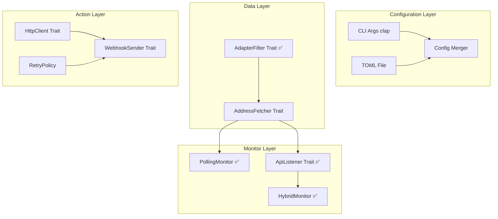

# Implementation Plan

> **Doc Maintenance**: Keep concise, avoid redundancy, clean up outdated content promptly to reduce AI context usage.

## Lint

```
make ci
```

## 架构概览



## 设计原则（摘要）

- **显式优于隐式**：`--ip-version` 无默认值，启动时必须指定；配置模板完整含注释
- **可测试性优先**：全依赖注入，Trait 抽象边界，纯函数优先
- **错误处理**：分层 Error enum，保留 source chain；API 失败降级到纯轮询
- **一次性语义**：`ApiListener::into_stream(self)` 消费 self，失败后降级而非重连

## CLI 设计

```text
ddns-a [OPTIONS] --url <URL> --ip-version <VERSION>
ddns-a init [--output <FILE>]

必需参数:
    --url <URL>                  Webhook URL
    --ip-version <VERSION>       ipv4 | ipv6 | both

请求配置:
    --method <METHOD>            [default: POST]
    --header <K=V>               可多次指定
    --bearer <TOKEN>             Bearer Token
    --body-template <TEMPLATE>   Handlebars 语法

网卡过滤:
    --include-adapter <PATTERN>  包含的网卡名正则
    --exclude-adapter <PATTERN>  排除的网卡名正则
    --exclude-virtual            排除虚拟网卡

监听配置:
    --poll-interval <SEC>        [default: 60]
    --poll-only                  禁用 API 事件

重试配置:
    --retry-max <N>              [default: 3]
    --retry-delay <SEC>          [default: 5]

其他:
    --config <FILE>              配置文件路径
    --dry-run                    测试模式
    --verbose                    详细日志
```

## 待实现模块设计

### AdapterFilter（filter 模块）

```rust
pub trait AdapterFilter: Send + Sync {
    fn matches(&self, adapter: &AdapterSnapshot) -> bool;
}

pub struct CompositeFilter {
    filters: Vec<Box<dyn AdapterFilter>>,
}

pub struct FilteredFetcher<F, A> {
    inner: F,
    filter: A,
}
```

### ApiListener（windows-listener 模块）

```rust
pub trait ApiListener: Send {
    type Stream: Stream<Item = Result<(), ApiError>> + Send + Unpin;
    fn into_stream(self) -> Self::Stream;
}
```

### HybridMonitor（hybrid 模块）

```rust
/// 混合监听器：API 事件 + 轮询保底
/// API 失败时降级到纯轮询模式（记录 WARN 日志，无自动恢复）
pub struct HybridMonitor<F, L, C = SystemClock> {
    fetcher: F,
    api_listener: L,
    clock: C,
    poll_interval: Duration,
    debounce: Option<DebouncePolicy>,
}

enum HybridState<S> {
    Hybrid { api_stream: S },
    PollingOnly,
}
```

### Webhook 模块

```rust
// webhook/http.rs
pub struct HttpRequest {
    pub method: http::Method,
    pub url: url::Url,
    pub headers: http::HeaderMap,
    pub body: Option<Vec<u8>>,
}

pub struct HttpResponse {
    pub status: http::StatusCode,
    pub headers: http::HeaderMap,
    pub body: Vec<u8>,
}

pub trait HttpClient: Send + Sync {
    async fn request(&self, req: HttpRequest) -> Result<HttpResponse, HttpError>;
}

// webhook/error.rs
pub enum HttpError {
    Connection(#[source] Box<dyn std::error::Error + Send + Sync>),
    Timeout,
    InvalidUrl(String),
}

pub enum RetryableError {
    Http(#[from] HttpError),
    Status { status: u16, body: Option<String> },
}

pub enum WebhookError {
    Retryable(#[from] RetryableError),
    MaxRetriesExceeded { attempts: u32, #[source] last_error: RetryableError },
}

// webhook/client.rs
pub struct ReqwestClient { inner: reqwest::Client }

// webhook/retry.rs
pub struct RetryPolicy {
    pub max_attempts: u32,        // default: 3
    pub initial_delay: Duration,  // default: 5s
    pub max_delay: Duration,      // default: 60s
    pub multiplier: f64,          // default: 2.0
}

// webhook/mod.rs
pub trait WebhookSender: Send + Sync {
    async fn send(&self, changes: &[IpChange]) -> Result<(), WebhookError>;
}

pub struct HttpWebhook<H> {
    client: H,
    url: url::Url,
    method: http::Method,
    headers: http::HeaderMap,
    body_template: Option<String>,
    retry_policy: RetryPolicy,
}
```

### Config 模块

```rust
// 已验证的内部配置
pub struct ValidatedConfig {
    pub ip_version: IpVersion,
    pub url: Url,
    pub poll_interval: Duration,
    // ...
}

impl ValidatedConfig {
    pub fn from_raw(cli: CliArgs, file: Option<TomlConfig>) -> Result<Self, ConfigError>;
}
```

## 关键依赖

| Crate | 用途 |
|-------|------|
| `windows` | Windows API |
| `tokio` + `tokio-stream` | 异步运行时 |
| `http` | HTTP 类型 |
| `url` | URL 解析 |
| `reqwest` | HTTP 客户端 |
| `clap` | CLI 解析 |
| `serde` + `toml` | 配置解析 |
| `tracing` | 结构化日志 |
| `thiserror` | 错误派生 |
| `regex` | 名称过滤 |
| `handlebars` | 模板渲染 |

## Todos

| ID | 任务 | 状态 | 依赖 |
|----|------|------|------|
| network-types | AdapterSnapshot/IpVersion/AdapterKind/AddressFetcher | ✅ | - |
| windows-fetch | WindowsFetcher (GetAdaptersAddresses) | ✅ | network-types |
| monitor-core | IpChange/IpChangeKind/MonitorError/ApiError/DebouncePolicy/diff() | ✅ | network-types |
| poller | PollingMonitor + PollingStream | ✅ | monitor-core |
| windows-listener | WindowsApiListener (NotifyIpInterfaceChange) | ✅ | windows-fetch, monitor-core |
| hybrid | HybridMonitor + HybridStream | ✅ | poller, windows-listener |
| filter | AdapterFilter trait + CompositeFilter + FilteredFetcher | ✅ | - |
| webhook-http | HttpRequest/HttpResponse/HttpClient/HttpError/ReqwestClient | ⬜ | - |
| webhook-sender | WebhookSender/HttpWebhook/RetryPolicy | ⬜ | webhook-http |
| config | TOML + CLI 合并 + init 命令 | ⬜ | - |
| main | 入口组装 + 配置摘要 + graceful shutdown | ⬜ | all |
